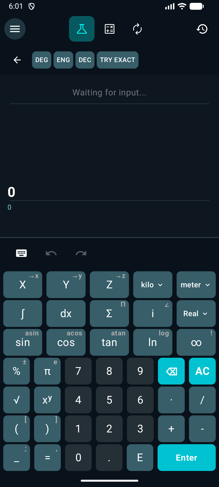
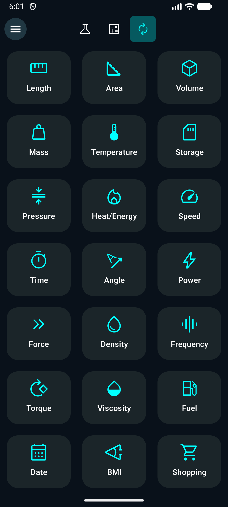
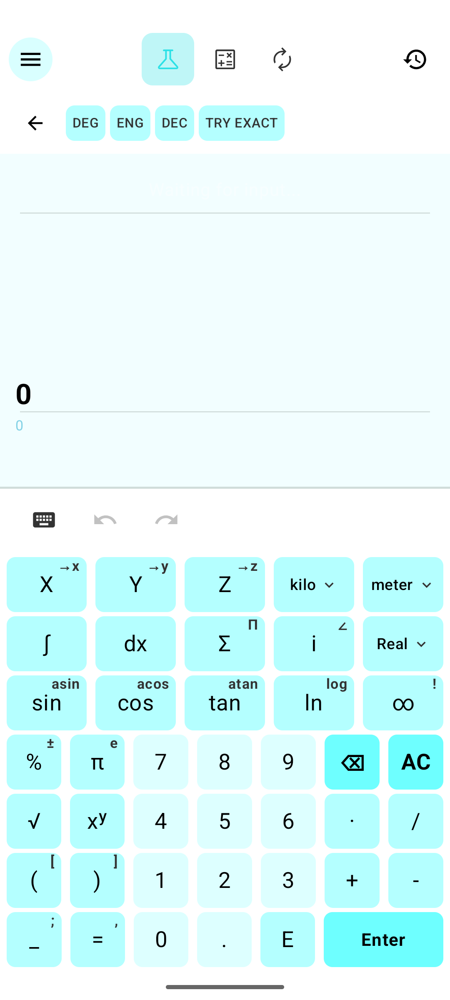
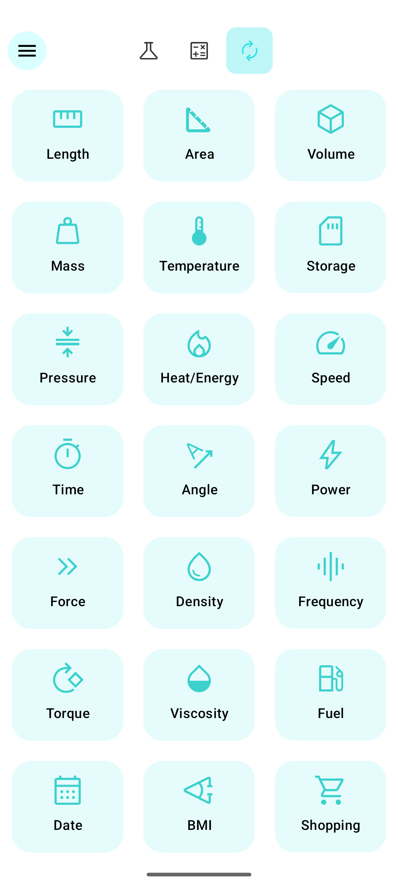

# UniCalculator

**A modern, open‑source calculator for Android – standard, scientific, and unit conversion, all in one.**

[](https://github.com/Jomet-Franklin/UniCalculator/blob/main/LICENSE)
[](https://github.com/Jomet-Franklin/UniCalculator/releases)
[](https://developer.android.com/)

---

## ✨ Features

- **Standard Calculator** – basic arithmetic, parentheses, trigonometric functions, logarithms, exponentiation, factorial, and percentage.
- **Scientific Calculator** – powered by the [Qalculate!](https://qalculate.github.io/) engine – complex numbers, integrals, sums, derivatives, multiple angle units, and flexible display formats.
- **Unit Converter** – 20+ categories (length, mass, volume, temperature, storage, pressure, speed, time, angle, power, force, density, frequency, torque, viscosity, fuel, date) plus **BMI** and **Shopping** calculators.
- **History** – stores your calculations; copy, share, or re‑use any result.
- **Themes** – Light, Dark, and Pure Black (AMOLED) modes.
- **100% Offline** – no data collection, no internet required.

---

## 📸 Screenshots

### Dark Mode

| Standard | Scientific | Converter |
|:---:|:---:|:---:|
|  |  |  |

### Light Mode

| Standard | Scientific |                        Converter                        |
|:---:|:---:|:-------------------------------------------------------:|
|  |  |  |
---

## 📥 Download

Get the latest APK from the [Releases](https://github.com/Jomet-Franklin/UniCalculator/releases) page.

---

## 🛠️ Build from Source

1. Clone the repository:


   ```bash
   git clone https://github.com/Jomet-Franklin/UniCalculator.git