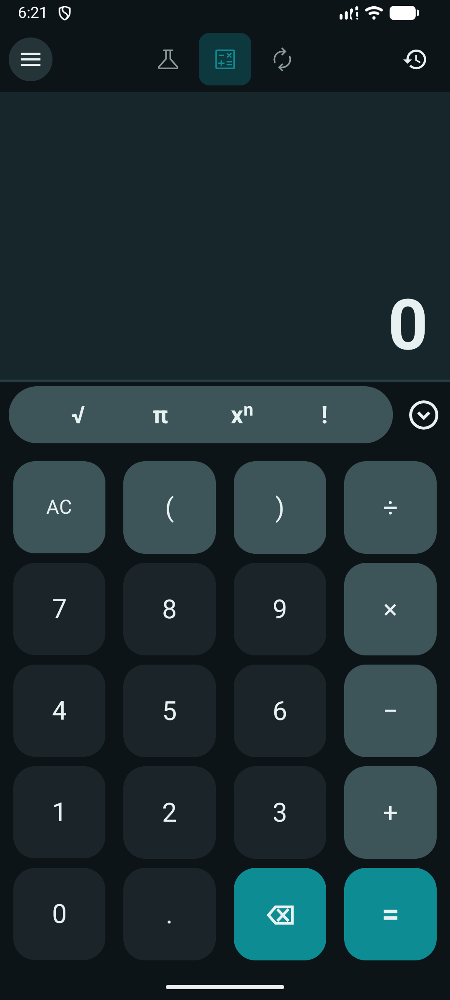
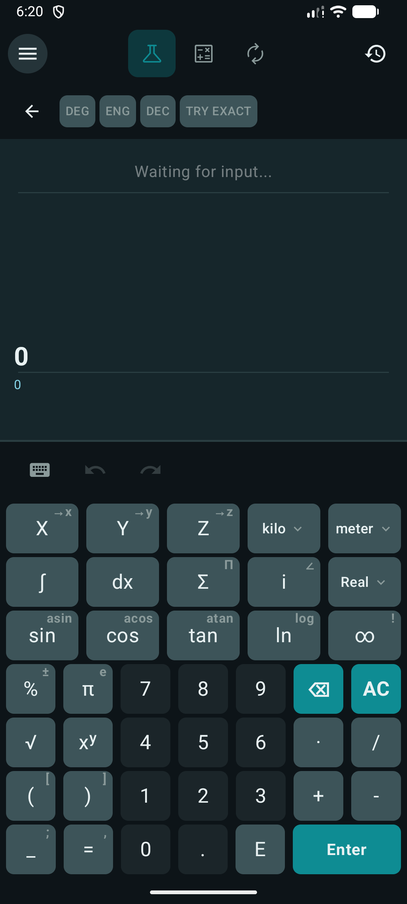

# UniCalculator

A versatile, open‑source calculator for Android – combining a standard calculator, a scientific engine (powered by Qalculate!), and a unit converter with 20+ categories, BMI, and shopping tools.

## Features

- **Standard** – basic arithmetic, parentheses, trig, log, exponentiation, factorial.
- **Scientific** – advanced math (complex numbers, integrals, sums, derivatives) with Qalculate! engine, multiple angle units, and flexible display formats.
- **Converter** – length, mass, volume, temperature, storage, pressure, speed, time, angle, power, force, density, frequency, torque, viscosity, fuel, date, plus BMI and shopping discount/unit price calculators.
- **History** – stores calculations; copy, share, or reuse results.
- **Themes** – Light, Dark, and Pure Black (AMOLED) modes.
- **Offline** – no data collection, no internet required.

## Screenshots

## Download

Grab the latest APK from the [Releases](https://github.com/YOUR_USERNAME/UniCalculator/releases) page.

## Build from Source

1. Clone the repo.
2. Open in Android Studio.
3. Build and run.

## License

GPL‑2.0 – see [LICENSE](LICENSE).

## Acknowledgements

- [Qalculate!](https://qalculate.github.io/) – the powerful calculation engine
- [qalculate-android](https://github.com/jherkenhoff/qalculate-android) – Android port
- All other open‑source libraries listed in the About screen.

## Contributing

Issues and pull requests are welcome.